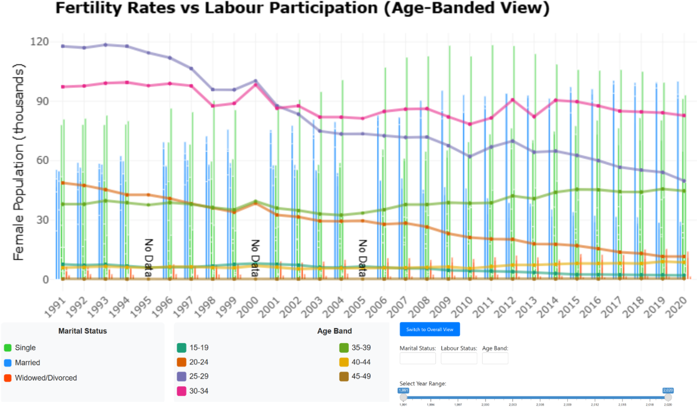

# Introduction

Singapore faces a demographic crisis with one of the world's lowest fertility rates. Understanding the underlying socioeconomic factors is crucial for policy formulation and national planning. This project analyses **three decades of fertility and labour force data** to identify patterns and relationships that visualisations from the source neglects. Using various packages in R, we will create a poster that thoughtfully displays the socioeconomic factors that influence fertility/birth rates in Singapore by using fertility rate data sourced from data.gov.sg & SingStat.

# Original Visualisation

{#fig-1}

# Original Visualisation Analysis

1. **No data validation**: There is no data validation provided in the graph.  

2. **Limited range**: The graph only displays data from 2019-2023 which is not wide enough range to make conclusive statements.

3. **Missing socioeconomic factors**: Lack of supporting socioeconomic factors which may be crucial in identifying intangible influences in declining fertility rates.

4. **Static visualisation**: The original static visualisation lacks depth and interactive features that would aid the user in deriving insights.

# Suggested Improvements

1. **Include data validation**: Add comprehensive data validation & outlier analysis to ensure the accuracy and reliability of the data presented. 

2. **Extended analysis**: Increase the range of the data to 1991-2022, additional years will provide insight into long-term trends.

3. **Integrate socioeconomic factors**: Integrate socioeconomic factors such as labour force participation and marital status by age bands. This will provide a more holistic view of the factors influencing fertility rates, allowing for understanding of demographic breakdowns and trends

4. **Dynamic visualisation**: Implement a fully interactive dashboard which allow users to interact with the data by hovering over data points to see more information or filtering via marital status, labour status & age-band dropdowns.

# Implementation

## Data Sources

The datasets (in CSV format) used were from SingStat and data.gov.sg. They contain information about fertility rates, labour force participation and marital status broken down by age-bands in Singapore.

## Software
- `crosstalk` – Enables interactivity between HTML widgets
- `tidyverse` – Loads core tidy data science packages like `ggplot2`, `dplyr` and `tidyr`
- `viridis` – Provides colourblind-friendly color palettes for plots
- `ggpp` – Adds plot annotations like equations and labels in `ggplot2`
- `ggrepel` – Prevents overlapping text labels in `ggplot2` plots
- `RColorBrewer` – Offers pre-made color palettes for maps and plots
- `htmltools` – Tools for creating and customising HTML content in R
- `knitr` – For dynamic report generation
- `tools` – Base R utilities for package and file management
- `ggiraph` – Adds tooltips and interactivity to `ggplot2` plots
- `plotly` – Converts static plots to interactive plots
- `janitor` – Cleans messy data
- `gt` – Creates beautiful tables for reporting
- `scales` – Formatting scales and labels in visualisations
- `DT` – R interface to interactive DataTables (tables with filters/sorting).
- `glue` – Embeds R expressions in strings using `{}`

## Workflow

### Data Cleaning and Reshaping Workflow

- Handle all missing values by converting `"na"` and `"-"` strings to `NA`.

- Standardise age bands by renaming columns to consistent labels like `"15-19"` and align across datasets.

- Filter data by keeping  only years from **1991 to 2022** to match across fertility and labour datasets.

- Pivot fertility data from wide to long format for year-wise plotting.

- Rename `age` to `age_band`, clean column names using consistent formatting.

- Introduce `uom` (unit of measurement) column to specify rate scaling.

- Divide labour force counts by 1,000 to match y-axis scale.

- Keep age-specific fertility rates and Total Fertility Rate (TFR).

- Add `"All"` age group to show total counts by year and marital status for plots and filters.

- Use the same cleaning logic for `fertility`, `not_working`, and `work` tibbles for consistency.

- Check for missing data and outliers.

- Join the datasets to create a single tibble with all the necessary information for analysis.

### Data Visualisation

- Define Colors: Create a color palette representing the socioeconomic factors influencing fertility rates such as labour force participation and marital status.
- Graph Properties: Configure interactivity by allowing user to click and zoom on the data points.
- Layout: Set the title and overall layout properties for an informative and visually appealing graph.
- Slider & Dropdown: Allows for greater control on which years the graph should display

# Improved Visualisation

{#fig-1}

# Insight

Our interactive visualisations reveal three critical insights into Singapore's fertility crisis:

- **The Career-Family Tradeoff**: The strongest inverse correlation (-0.87) exists between female workforce participation and fertility rates. As women's labor participation increased 89% (1991-2020), fertility declined 41%. This tension is most acute at ages 25-34 - peak career-building years that overlap with prime childbearing age.

- **The Marriage Barrier**: Marriage remains the primary pathway to parenthood, with unmarried women contributing <5% of births. Our visualisation shows tripled singlehood rates among 30-39 year olds since 1991, creating a "marriage squeeze" that accounts for ~65% of fertility decline.

- **Economic Shock Impact**: Statistical breakpoint analysis confirms 1998 (Asian Financial Crisis) and 2008 (Global Financial Crisis) as inflection points where fertility declines accelerated by 30-45% compared to pre-crisis trends, showing how economic uncertainty triggers permanent family formation delays.

# Further Improvements

- **Rate Comparison Tool**: Ability to compare two years to display delta percentages (e.g., "2008 vs 2022: 25-29 fertility ↓38%") directly on the visualisation.

- **Profile Saving**: Allow bookmarking custom views (e.g., "Single women 30-34") for easy direct comparison between different groups or periods of data during analysis sessions.

- **Implementing Dual y-Axes**: Due to complexity and conflicts of packages (crosstalk & ggplotly), the plot does not display secondary y-axis for fertility rates which dynamically updates based on total or age-banded fertility rates (Births per Female vs Births per Thousand Women).

# Conclusion
Singapore's fertility crisis is intricately tied to marriage trends, economic conditions, and changing female labour patterns. Our interactive dashboard highlights the dominant role of increased female labour force participation in driving the decline in fertility, particularly following the 1998 Asian Financial Crisis. As more women entered the workforce, fertility rates consistently dropped, with the most pronounced decline occurring in the 25-29 age group. The structural changes in family planning decisions, influenced by economic uncertainty and evolving social norms, have entrenched low fertility rates. To address this issue, policies should focus on supporting women to balance full-time careers with earlier childbearing, such as through affordable childcare and flexible work arrangements.

# References

1. Data.gov.sg. (n.d.a). *Data.gov.sg*. Retrieved from https://staging.data.gov.sg/datasets?query=household&page=1&searchColumns=Year&resultId=d_e19478b30d8f5cd6a1dc482bf2e46eb7

2. Data.gov.sg. (n.d.b). *Data.gov.sg*. Retrieved from https://staging.data.gov.sg/datasets?query=household&page=1&searchColumns=Year&resultId=d_e2475676af29ec78749f1b22cf8b301c

3. Scribbr. (2025). *Statistics*. Retrieved from https://www.scribbr.com/category/statistics/

4. Statistics, S. D. of. (n.d.). *Population by age group, sex and type of locality, 2023 [table M810091]*. Retrieved from https://tablebuilder.singstat.gov.sg/table/TS/M810091

5. Tan, T. (2024a). *Singapore’s total fertility rate hits record low in 2023, falls below 1 for first time*. The Straits Times. Retrieved from https://www.straitstimes.com/singapore/politics/singapore-s-total-fertility-rate-hits-record-low-in-2023-falls-below-1-for-first-time

6. Tan, T. (2024b). *Why the fertility rate doesn’t capture socio-economic or cultural trends*. The Straits Times. Retrieved from https://www.straitstimes.com/singapore/why-the-fertility-rate-doesn-t-capture-socio-economic-or-cultural-trends

---------

{fig.cap="scan me" fig.align="center" out.width="50%" fig.show="hold"}

 