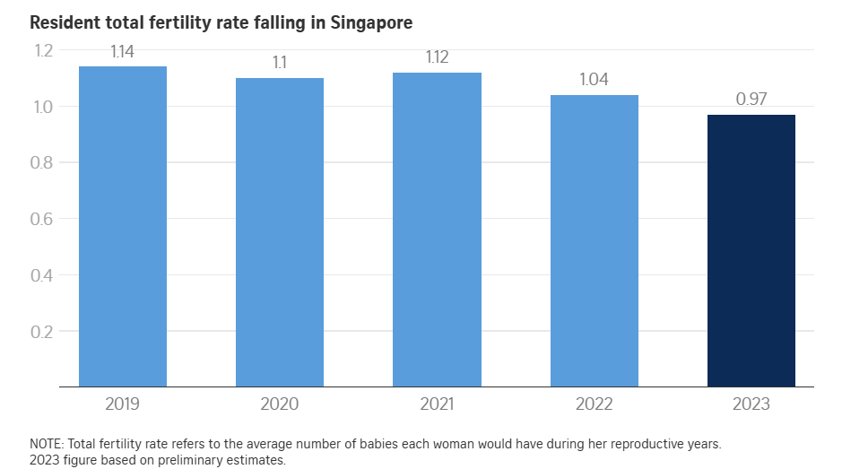

```{r setup, message=FALSE, warning=FALSE, echo=FALSE}
# Load necessary libraries (things that are def needed)
library(crosstalk)
library(tidyverse) # for data manipulation and visualization
library(viridis) # for color scales
library(ggpp) # for position_dodgenudge 
library(ggrepel) # for text repelling
library(RColorBrewer) # color palettes specifically tailored for data visualization
library(crosstalk)
library(htmltools)
library(dplyr)
library(knitr)
library(tools) # 
library(ggiraph)
library(ggplot2) # for plotting
library(plotly) # for interactive plots
library(janitor) # for cleaning 
library(gt)
library(stringr)
library(scales)
library(forcats)
library(DT) #test
# may not be needed/not used
# library(directlabels) # for categorical text labeling
# library(ggforce) # for enclosing shapes

#to be verified USE gt package not kable
library(kableExtra)
library(corrplot)
library(broom)


# Set global options
options(scipen = 999)
knitr::opts_chunk$set(
  echo = TRUE,
#  warning = FALSE,
#  message = FALSE,
  fig.align = "center",
  out.width = "100%"
)
```

# Executive Summary

Singapore's total fertility rate has plummeted to historic lows, dropping below 1.0 for the first time in 2023. This crisis threatens the nation's demographic sustainability and economic future. Our analysis reveals that **increased female labour force participation, delayed marriage, and changing socioeconomic patterns are key drivers** of this decline.

------------------------------------------------------------------------

# Introduction

## Background & Significance

Singapore faces a demographic crisis with one of the world's lowest fertility rates. Understanding the underlying socioeconomic factors is crucial for policy formulation and national planning. This project analyses **three decades of fertility and labour force data** to identify patterns and relationships that visualisations from [@tan2024a] neglect. Using various packages in R, we will create a poster that thoughtfully displays the socioeconomic factors that influence fertility/birth rates in Singapore by using fertility rate data sourced from [@singstat2023] as well as labour participation and marital status data from [@datagovsg2020a] and [@datagovsg2020b].

**Disclaimer:** *To note that data for 1995, 2000 and 2005 are not available as the Comprehensive Labour Force Survey was not conducted in these years due to the conduct of the Population Census 2000, General Household Surveys 1995 and 2005 by the Singapore Department of Statistics.*

## Research Questions

1.  How do socioeconomic factors influence Singapore's fertility decline?
2.  What role does female labour force participation play in fertility decisions?
3.  Which age groups and marital statuses are most affected?
4.  Can we identify critical inflection points in the fertility decline?

------------------------------------------------------------------------

# Critical Analysis of Original Visualisation

## Original Visualisation



*Source: [Straits Times: Singapore's total fertility rate hits record low in 2023](https://www.straitstimes.com/singapore/politics/singapore-s-total-fertility-rate-hits-record-low-in-2023-falls-below-1-for-first-time)*

## Strengths & Weaknesses Analysis

```{r analysis-table, echo=FALSE}
#| label: tbl-1
#| tbl-cap: "Comprehensive Analysis of Original Visualisation vs Our Improvements"

# Create the data frame
analysis_df <- data.frame(
  Strengths = c(
    "Uses official SingStat data",
    "Clear recent trend shown",
    "Headline-grabbing impact",
    "Clean, professional format",
    "Focuses on key metric",
    "Accessible to general public"
  ),
  Weaknesses = c(
    "No data validation shown",
    "Limited to 2019-2023 only",
    "Missing socioeconomic factors",
    "Static visualisation",
    "No age-specific breakdown",
    "Lacks analytical depth"
  ),
  Our_Improvements = c(
    "Comprehensive data validation & outlier analysis",
    "Extended analysis: 1990-2022 (32 years)",
    "Integrated labour force & marital status data",
    "Fully interactive dashboard",
    "Age-specific fertility rates by group",
    "Multi-layered analytical approach"
  )
)

# Create the table using gt
gt_table <- analysis_df |>
  gt() |>
  cols_label(
    Strengths = "Strengths",
    Weaknesses = "Weaknesses",
    Our_Improvements = "Our Improvements"
  ) |>
  tab_style(
    style = list(
      cell_text(weight = "bold")  # Bold the column headers
    ),
    locations = cells_column_labels(columns = c("Strengths", "Weaknesses", "Our_Improvements"))  # Apply to all column headers
  ) |>
  tab_options(
    table.font.size = 12,
    table.width = pct(80)
  ) |>
  opt_table_font(
    font = "Arial"
  )

# Display the table
gt_table
```

The original visualisations focus on Singapore's total fertility rate (TFR) from 2019 to 2023, but fail to explore the socioeconomic factors driving the decline. Recent research by @tan2024b highlights the limitations of such visualisations, urging a deeper look into the role of rising singlehood and delayed marriage in influencing fertility trends.

------------------------------------------------------------------------

# Data Sources & Methodology

```{r data-sources, echo=FALSE}
#| eval: true
#| output-location: column
#| label: tbl-2
#| tbl-cap: "Data Sources Overview"

# Create the data frame
data_sources <- data.frame(
  Dataset = c("Fertility Rates", "Labour Force (Working)", "Labour Force (Not Working)"),
  Source = c("SingStat", "data.gov.sg", "data.gov.sg"),
  Time_Period = c("1960-2024", "1991-2022", "1991-2022"),
  Variables = c("Age-specific fertility rates, Total fertility rate", 
                "Female labour force by age & marital status",
                "Females outside labour force by age & marital status"),
  Records = c("17 variables wide format", "5 columns long format", "5 columns long format")
)

# Create the table using gt
gt_table <- data_sources |>
  gt() |>
  cols_label(
    Dataset = "Dataset",
    Source = "Source",
    Time_Period = "Time Period",
    Variables = "Variables",
    Records = "Records"
  ) |>
  tab_style(
    style = list(
      cell_text(weight = "bold")  # Bold the column headers
    ),
    locations = cells_column_labels(columns = c("Dataset", "Source", "Time_Period", "Variables", "Records"))  # Apply to all column headers
  ) |>
  tab_options(
    table.font.size = 12,
    table.width = pct(80)
  ) |>
  opt_table_font(
    font = "Arial"
  )

# Display the table
gt_table

```

## Data Engineering Pipeline

```{r data-loading, echo=TRUE}
# Load datasets with proper error handling
fertility <- read_csv(
  "datasets/ResidentFertilityRate.csv",
  skip = 9,
  n_max = 17,
  show_col_types = FALSE
)

work <- read_csv("datasets/ResidentLabourForceAged15YearsandOverbyMaritalStatusAgeandSex.csv", 
                 show_col_types = FALSE)

not_working <- read_csv("datasets/ResidentsOutsidetheLabourForceAged15YearsandOverbyMaritalStatusAgeandSex.csv", 
                       show_col_types = FALSE)

cat("✓ Data loaded successfully\n")
cat("Fertility data shape:", dim(fertility), "\n")
cat("Labour force data shape:", dim(work), "\n")
cat("Outside labour force data shape:", dim(not_working), "\n")
```

## Data Cleaning & Transformation

The following steps will be taken to clean and reshape "`fertility`":

-   "`fertility`" tibble contains "na" strings which are not actually NA values, these points will need to be converted to NA values

-   fertility rate data from SingStat is in wide format with years as the columns, we will pivot long for year-wise plots

-   fertility rate data goes up till 2024, whereas the labour force data only goes up till 2022, we will filter the fertility rate data to only include years after 1990 and up till 2022

-   standardise age banding of fertility rate dataset to be consistent with labour force data. For example, "15-19" instead of "15 - 19 Years (Per Thousand Females)' and also keep Total Fertility Rate data (aggregated across all age bands)

-   filtered to include age specific fertility rates and the total fertility rate by year

-   introduce Unit of Measurement (uom) column to indicate scaling for Total Fertility Rates and age banded fertility rates

The following steps will be taken to clean and reshape "`not_working`":

-   standardise column names to the 7 (15-19, 20-24, 25-29, 30-34, 35-39, 40-44, 45-49) age bands to be consistent with fertility and remove extra bandings

-   for labour datasets, divide labour_force values by 1000 to align with count (in thousands) y-axis variable

-   some outside_labour_force values are "-" which are not valid numerics, convert these to NA

-   rename age column to age_band to match `fertility`

-   aggregate age bands to introduce "All" to represent population outside labour force by year and marital status only, this is so that we can introduce interactivity with Total Fertility Rate and fertility rates across age bands

"work" tibble is cleaned in a similar way to "not_working".

```{r data-cleaning, echo=TRUE}
# Enhanced fertility data cleaning
fertility_clean <- fertility |>
  clean_names() |>
  rename(measure = data_series) |>
  mutate(across(-measure, as.character)) |>
  pivot_longer(
    cols = -measure,
    names_to = "year",
    values_to = "value"
  ) |>
  mutate(
    year = as.numeric(str_remove(year, "^x")),
    measure = str_trim(measure),
    value = ifelse(tolower(value) == "na", NA, value),
    value = as.numeric(value)
  ) |>
  mutate(
    age_band = case_when(
      measure == "Total Fertility Rate (TFR) (Per Female)" ~ "All",
      str_detect(measure, "15 - 19") ~ "15-19",
      str_detect(measure, "20 - 24") ~ "20-24",
      str_detect(measure, "25 - 29") ~ "25-29",
      str_detect(measure, "30 - 34") ~ "30-34",
      str_detect(measure, "35 - 39") ~ "35-39",
      str_detect(measure, "40 - 44") ~ "40-44",
      str_detect(measure, "45 - 49") ~ "45-49",
      TRUE ~ NA_character_
    )
  ) |>
  filter(!is.na(age_band)) |>
  mutate(
    uom = case_when(
      age_band == "All" ~ "per female",
      TRUE ~ "per thousand females"
    )
  ) |>
  filter(year >= 1990 & year <= 2020) |>
  select(year, age_band, fertility_rate = value, uom)

# Enhanced labour force data cleaning
clean_labour_data <- function(data, value_col) {
  data |>
    clean_names() |>
    filter(age %in% c("15-19", "20-24", "25-29", "30-34", "35-39", "40-44", "45-49")) |>
    mutate(
      !!value_col := na_if(!!sym(value_col), "-"),
      !!value_col := as.numeric(!!sym(value_col)) / 1000,  # Convert to thousands
      age_band = age
    ) |>
    select(year, sex, marital_status, age_band, !!value_col)
}

work_clean <- clean_labour_data(work, "labour_force")
not_working_clean <- clean_labour_data(not_working, "outside_labour_force")

# Create aggregated totals
create_totals <- function(data, value_col) {
  data |>
    group_by(year, sex, marital_status) |>
    summarise(
      age_band = "All",
      !!value_col := sum(!!sym(value_col), na.rm = TRUE),
      .groups = "drop"
    )
}

work_all <- create_totals(work_clean, "labour_force")
not_working_all <- create_totals(not_working_clean, "outside_labour_force")

# Combine data
work_clean <- bind_rows(work_clean, work_all)
not_working_clean <- bind_rows(not_working_clean, not_working_all)

cat("✓ Data cleaning completed successfully\n")
```

------------------------------------------------------------------------

# Data Integration & Final Dataset

## Data Integration Strategy

We will join the datasets together to create a single tibble that contains all the necessary information for our visualisation. The joined tibble will contain the following columns:

-   `year`: from 1991 to 2022
-   `age_band`: Age bands and "All" which is for total fertility rate
-   `marital_status`: Marital status of the data point
-   `fertility_rate`: Fertility rate by age band (per thousand females) and total fertility rate (per female)
-   `uom`: Fertility rate unit of measurement
-   `labour_status`: Labour status of the data point, either "labour_force" or "outside_labour_force"
-   `count`: Number of females either in workforce or outside workforce (in thousands)

### Filter to Female Population Only

```{r filter-female}
#| echo: true
#| eval: true

# Filter labour data to only include females
work_clean_female <- work_clean |> 
  filter(sex == "female") |> 
  select(-sex)

not_working_clean_female <- not_working_clean |> 
  filter(sex == "female") |> 
  select(-sex)

cat("✓ Filtered to female population only\n")
cat("Working females data shape:", dim(work_clean_female), "\n")
cat("Non-working females data shape:", dim(not_working_clean_female), "\n")
```

### Combine Labour Force Data

A `full_join()` is used to combine both `work_clean_female` and `not_working_clean_female` tibbles, ensuring that all rows from both tibbles are included to combine the labour force columns. The join is done on the `year`, `marital_status`, and `age_band` columns, common dimensions to both tibbles to prevent any data loss.

```{r combine-labour}
#| echo: true
#| eval: true

# Combine female labour and not working into one tibble
labour_status_female <- full_join(
  work_clean_female, 
  not_working_clean_female, 
  by = c("year", "marital_status", "age_band")
)

cat("✓ Combined labour force data successfully\n")
cat("Combined labour data shape:", dim(labour_status_female), "\n")
```

### Join with Fertility Data

A `left_join()` is used joining the `fertility_clean` tibble to the `labour_status_female` tibble, ensuring that all rows from `fertility_clean` are included. This will allow us to combine and be able to associate fertility rates with labour force participation data.

```{r join-fertility}
#| echo: true
#| eval: true

# Join fertility data with labour status data
fertility_labour_joined <- fertility_clean |>
  left_join(labour_status_female, by = c("year", "age_band"))

cat("✓ Joined fertility and labour data successfully\n")
cat("Joined data shape:", dim(fertility_labour_joined), "\n")
```

### Transform to Long Format

Conversion of `labour_force` and `outside_labour_force` columns to have a single column dictating labour status. Years that do not have corresponding labour force data (1995, 2000, 2005) are filtered out as noted in our disclaimer.

```{r transform-long}
#| echo: true
#| eval: true

# Create final analytical dataset
final_dataset <- fertility_labour_joined |>
  pivot_longer(
    cols = c("labour_force", "outside_labour_force"),
    names_to = "labour_status",
    values_to = "count"
  ) |>
  group_by(year) |>
  filter(!all(is.na(count))) |>  # Remove years with no labour data (1995, 2000, 2005)
  ungroup() |>
  mutate(
    count = replace_na(count, 0),
  ) |>
  filter(!is.na(fertility_rate))  # Remove rows with missing fertility data
```

### Create Aggregated Totals for Analysis

```{r create-totals}
#| echo: true
#| eval: true

# Create aggregated totals function for reusability
create_totals <- function(data, value_col) {
  data |>
    group_by(year, sex, marital_status) |>
    summarise(
      age_band = "All",
      !!value_col := sum(!!sym(value_col), na.rm = TRUE),
      .groups = "drop"
    )
}

# Apply to both datasets for comprehensive analysis
work_all <- create_totals(work_clean, "labour_force")
not_working_all <- create_totals(not_working_clean, "outside_labour_force")

# Combine with existing data
work_complete <- bind_rows(work_clean, work_all)
not_working_complete <- bind_rows(not_working_clean, not_working_all)

cat("✓ Created aggregated totals for comprehensive analysis\n")
cat("Work data with totals shape:", dim(work_complete), "\n")
cat("Not working data with totals shape:", dim(not_working_complete), "\n")
```

## Dataset Integration Results

The final integrated dataset successfully combines:

-   **Fertility rates** from SingStat (1990-2022)
-   **Female labour force participation** from data.gov.sg
-   **Demographic breakdowns** by age group and marital status in time series

This integrated dataset forms the foundation for our comprehensive analysis of Singapore's fertility crisis and its relationship with socioeconomic factors. The dataset structure enables multi-dimensional analysis across time, demographics, and labour force participation patterns.

```{r preview-final-data}
#| echo: true
#| eval: true
#| label: tbl-5
#| tbl-cap: "Preview of `final_dataset`"


datatable(
  final_dataset,
  class    = "compact stripe hover",   # make rows & font more compact
  extensions = 'Buttons',
  filter     = "none",   # turn off per-column filters
  options = list(
    pageLength = 6,
    scrollX    = TRUE,
    dom        = 'Bfrtip',                # Buttons, global filter, table, info, pagination
    buttons    = list(
      list(extend = 'csv', text = 'Export CSV')
    )
  ),
  rownames = FALSE
)
```

------------------------------------------------------------------------

# Enhanced Data Visualisation
## Interactive Dashboard

this code allows for clicking of the legend trace and labels to filter the data. but it has the ("label",1) naming issue. i gave up on this, theres no way to use ggplot2 and ggplotly to fix the legend. must use plotly or shiny or somehing else. I am trying to create a custom legend below and then slowly integrate the dropdown across all variables later in the next code chunk.

```{r interactive-agebanded-dashboard, echo=TRUE}
# 1. Aggregate labour counts across ALL age bands for each marital_status × labour_status
agg_counts <- final_dataset |>
  group_by(year, marital_status, labour_status) |>
  summarise(count = sum(count, na.rm = TRUE), .groups = "drop") |>
  mutate(
    status = fct_inorder(paste(marital_status, labour_status, sep = " / "))
  )

# 2. Create Crosstalk shared dataset with proper key
shared_counts <- SharedData$new(
  agg_counts, 
  key = ~interaction(marital_status, labour_status), 
  group = "labour_group"
)

# 3. Create separate filters for marital and labour status
filter_marital <- filter_select(
  id    = "marital_filter",
  label = "Select Marital Status:",
  sharedData = shared_counts,
  group = ~marital_status
)

filter_labour <- filter_select(
  id    = "labour_filter",
  label = "Select Labour Status:",
  sharedData = shared_counts,
  group = ~labour_status
)

# 4. Fertility lines by age_band (excluding "All" total)
fertility_ab <- final_dataset |>
  filter(age_band != "All") |>
  distinct(year, age_band, fertility_rate)

# Create separate shared data for lines
shared_lines <- SharedData$new(fertility_ab, key = ~age_band, group = "age_group")

# 5. Age band filter
filter_age <- filter_select(
  id    = "age_filter",
  label = "Select Age Band:",
  sharedData = shared_lines,
  group = ~age_band
)

# 6. Compute scale_factor
max_count     <- max(agg_counts$count, na.rm = TRUE)
max_fertility <- max(fertility_ab$fertility_rate, na.rm = TRUE)
scale_factor  <- max_count / max_fertility

# 7. Build the ggplot
p_ab <- ggplot() +
  # Bars (using shared_counts)
  geom_col(
    data = shared_counts,
    aes(
      x     = year,
      y     = count,
      fill  = status,
      group = status,
      text  = paste0(
        "Year: ", year,
        "<br>Marital: ", marital_status,
        "<br>Labour: ", labour_status,
        "<br>Count: ", comma(count)
      )
    ),
    position = position_dodge(width = 0.8),
    colour   = "white",
    size     = 0.2,
    alpha    = 0.8
  ) +
  # Lines (using shared_lines)
  geom_line(
    data = shared_lines,
    aes(
      x     = year,
      y     = fertility_rate * scale_factor,
      colour= age_band,
      group = age_band,
      text  = paste0(
        "Year: ", year,
        "<br>Age band: ", age_band,
        "<br>Fertility: ", round(fertility_rate,2)
      )
    ),
    size  = 0.8,
    alpha = 0.8
  ) +
  # Points
  geom_point(
    data = shared_lines,
    aes(
      x      = year,
      y      = fertility_rate * scale_factor,
      colour = age_band,
      text   = paste0(
        "Year: ", year,
        "<br>Age band: ", age_band,
        "<br>Fertility: ", round(fertility_rate,2)
      )
    ),
    size = 1
  ) +
  # Dual axis setup
  scale_y_continuous(
    name   = "Female Population (thousands)",
    labels = comma,
    sec.axis = sec_axis(
      transform = ~ . / scale_factor,
      name      = "Fertility Rate (per thousand females)",
      labels    = label_number(accuracy = 0.1)
    )
  ) +
  # Color scales
  scale_fill_manual(
    name   = "Marital & Labour Status",
    values = c(
      "married / labour_force"                  = "green3",
      "married / outside_labour_force"          = "darkgreen",
      "single / labour_force"                   = "red2",
      "single / outside_labour_force"           = "darkred",
      "widowed_divorced / labour_force"         = "blue1",
      "widowed_divorced / outside_labour_force" = "blue4"
    )
  ) +
  scale_colour_brewer(
    palette = "Set2",
    name    = "Age Band"
  ) +
  # Labels and theme
  labs(
    title    = "Age‐Banded Fertility Rates vs Female Labour Counts",
    subtitle = "Bars by Marital & Labour Status; Lines by Age Band",
    x        = "Year",
    caption  = "Data: SingStat & data.gov.sg"
  ) +
  theme_minimal(base_size = 12) +
  theme(
    plot.title       = element_text(face = "bold", size = 12),
    plot.subtitle    = element_text(size = 12, color = "gray60"),
    axis.title       = element_text(face = "bold", size = 6),
    legend.position  = "none",  # We'll use custom legend instead
    panel.grid.minor = element_blank()
  )

# 8. Convert to Plotly
interactive_ab <- ggplotly(p_ab, tooltip = "text") %>%
  layout(
    margin = list(l = 80, r = 80, b = 200, t = 80)  # Extra bottom space
  )

# 9. Disable built-in legend for data traces
for(i in seq_along(interactive_ab$x$data)) {
  interactive_ab$x$data[[i]]$showlegend <- FALSE
}

# 10. Create custom legend traces
# Marital/Labour status legend (squares)
status_combinations <- list(
  list(name = "Married - In Labour", color = "green3", key = "married / labour_force"),
  list(name = "Married - Not Working", color = "darkgreen", key = "married / outside_labour_force"),
  list(name = "Single - In Labour", color = "red2", key = "single / labour_force"),
  list(name = "Single - Not Working", color = "darkred", key = "single / outside_labour_force"),
  list(name = "Divorced/Widowed - In Labour", color = "blue1", key = "widowed_divorced / labour_force"),
  list(name = "Divorced/Widowed - Not Working", color = "blue4", key = "widowed_divorced / outside_labour_force")
)

status_traces <- lapply(status_combinations, function(item) {
  list(
    name       = item$name,
    legendgroup= "status_legend",
    x          = c(NA),  # Single invisible point
    y          = c(NA),
    type       = "scatter",
    mode       = "markers",
    marker     = list(
      color  = item$color,
      symbol = "square",
      size   = 8
    ),
    showlegend = TRUE
  )
})

# Age‐band legend (lines)
age_bands  <- c("15-19","20-24","25-29","30-34","35-39","40-44","45-49")
age_colors <- RColorBrewer::brewer.pal(length(age_bands), "Set2")

age_traces <- lapply(seq_along(age_bands), function(i) {
  list(
    name       = age_bands[i],
    legendgroup= "age_legend",
    x          = c(NA),  # Single invisible point
    y          = c(NA),
    type       = "scatter",
    mode       = "lines",
    line       = list(color = age_colors[i], width = 3),
    showlegend = TRUE
  )
})

# 11. Append custom legend traces
interactive_ab$x$data <- c(
  interactive_ab$x$data,
  status_traces,
  age_traces
)

# 12. Configure legend layout
interactive_ab <- interactive_ab %>%
  layout(
    legend = list(
      orientation = "h",
      y = -0.25,  # Position below chart
      x = 0.5,
      xanchor = "center",
      traceorder = "normal",
      itemsizing = "constant",
      font = list(size = 10),
      itemwidth = 30
    )
  )

# 13. Render final visualization
tagList(
  div(style = "margin-bottom:20px;",
      h3("Interactive Fertility Dashboard"),
      p("Use dropdowns to filter by marital status, labour status, and age band")
  ),
  div(style = "display: flex; flex-wrap: wrap; gap: 10px; margin-bottom: 10px;",
      div(style = "flex: 1; min-width: 200px;", filter_marital),
      div(style = "flex: 1; min-width: 200px;", filter_labour),
      div(style = "flex: 1; min-width: 200px;", filter_age)
  ),
  interactive_ab
)
```

## Interactive Dashboard but with custom legend label

so far so good, need to implement genuine interactivity now.

```{r}

# 1. Aggregate labour counts across ALL age bands for each marital_status × labour_status
agg_counts <- final_dataset |>
  group_by(year, marital_status, labour_status) |>
  summarise(count = sum(count, na.rm = TRUE), .groups = "drop") |>
  mutate(
    status = fct_inorder(paste(marital_status, labour_status, sep = " / "))
  )

# 2. Crosstalk SharedData & filter
shared_counts <- SharedData$new(agg_counts, group = "labour_status_ab")
filter_ab <- filter_select(
  id         = "labour_ab_filter",
  label      = "Select Labour Status:",
  sharedData = shared_counts,
  group      = ~labour_status
)

# 3. Fertility lines by age_band (excluding the "All" total)
fertility_ab <- final_dataset |>
  filter(age_band != "All") |>
  distinct(year, age_band, fertility_rate)

# 4. Compute scale_factor so that max(fertility_rate) → max(count)
max_count     <- max(agg_counts$count,             na.rm = TRUE)
max_fertility <- max(fertility_ab$fertility_rate, na.rm = TRUE)
scale_factor  <- max_count / max_fertility

# 5. Build the ggplot
p_ab <- ggplot() +
  geom_col(
    data = shared_counts,
    aes(
      x           = year,
      y           = count,
      fill        = status,
      group       = status,
      legendgroup = status,
      text        = paste0(
        "Year: ", year,
        "<br>Status: ", tools::toTitleCase(gsub("_"," ", status)),
        "<br>Count: ", comma(count)
      )
    ),
    position = position_dodge(width = 0.8),
    colour   = "white",
    size     = 0.2,
    alpha    = 0.8
  ) +
  geom_line(
    data = fertility_ab,
    aes(
      x           = year,
      y           = fertility_rate * scale_factor,
      colour      = age_band,
      group       = age_band,
      legendgroup = age_band,
      text        = paste0(
        "Year: ", year,
        "<br>Age band: ", age_band,
        "<br>Fertility: ", round(fertility_rate,2)
      )
    ),
    size = 0.8,
    alpha = 0.8
  ) +
  geom_point(
    data = fertility_ab,
    aes(
      x      = year,
      y      = fertility_rate * scale_factor,
      colour = age_band,
      group  = age_band,
      legendgroup = age_band,
      text   = paste0(
        "Year: ", year,
        "<br>Age band: ", age_band,
        "<br>Fertility: ", round(fertility_rate,2)
      )
    ),
    size = 1
  ) +
  scale_y_continuous(
    name   = "Female Population (thousands)",
    labels = comma,
    sec.axis = sec_axis(
      transform = ~ . / scale_factor,
      name      = "Fertility Rate (per thousand females)",
      labels    = label_number(accuracy = 0.1)
    )
  ) +
  scale_fill_manual(
    name   = "Marital Status / Labour Status",
    values = c(
      "married / labour_force"                  = "#00CD00",  # green3
      "married / outside_labour_force"          = "#006400",  # darkgreen
      "single / labour_force"                   = "#EE0000",  # red2
      "single / outside_labour_force"           = "#8B0000",  # darkred
      "widowed_divorced / labour_force"         = "#0000FF",  # blue1
      "widowed_divorced / outside_labour_force" = "#00008B"   # blue4
    )
  ) +
  scale_colour_brewer(
    palette = "Set2",
    name    = "Age Band"
  ) +
  labs(
    title    = "Age‐Banded Fertility Rates vs Female Labour Counts",
    subtitle = "Bars by Marital & Labour Status; Lines by Age Band",
    x        = "Year",
    caption  = "Data: SingStat & data.gov.sg"
  ) +
  theme_minimal(base_size = 12) +
  theme(
    plot.title       = element_text(face = "bold", size = 12),
    plot.subtitle    = element_text(size = 12, color = "gray60"),
    axis.title       = element_text(face = "bold", size = 6),
    legend.position  = "bottom",
    panel.grid.minor = element_blank()
  )

# 6. Convert to Plotly
interactive_ab <- ggplotly(p_ab, tooltip = "text") %>%
  layout(
    legend = list(
      orientation = "h",
      x           = 0.5,
      xanchor     = "center",
      y           = -0.25,
      font        = list(size = 8),
      title       = list(
        text = "Marital Status / Labour Status",
        font = list(size = 10)
      ),
      itemwidth   = 70
    ),
    margin = list(
      l = 80,    # left
      r = 80,    # right
      b = 140,   # bottom
      t = 80
    )
  )

# 7. Turn off built-in legends
for(i in seq_along(interactive_ab$x$data)) {
  interactive_ab$x$data[[i]]$showlegend <- FALSE
}

# 8. Define EXACT color mapping for status categories
status_colors <- c(
  "married / labour_force"                  = "#00CD00",  # green3
  "married / outside_labour_force"          = "#006400",  # darkgreen
  "single / labour_force"                   = "#EE0000",  # red2
  "single / outside_labour_force"           = "#8B0000",  # darkred
  "widowed_divorced / labour_force"         = "#0000FF",  # blue1
  "widowed_divorced / outside_labour_force" = "#00008B"   # blue4
)

status_labels <- c(
  "Married – In Labour Force",
  "Married – Outside Labour Force",
  "Single – In Labour Force",
  "Single – Outside Labour Force",
  "Divorced/Widowed – In Labour Force",
  "Divorced/Widowed – Outside Labour Force"
)

# 9. Create status legend using exact hex colors
status_traces <- lapply(1:6, function(i) {
  list(
    x = NA, 
    y = NA,
    name = status_labels[i],
    type = "scatter",
    mode = "markers",
    marker = list(
      color = status_colors[i],
      symbol = "square",
      size = 8
    ),
    showlegend = TRUE,
    hoverinfo = "none"  # Prevent hover info on legend items
  )
})

# 10. Create age-band legend with explicit colors
age_bands <- c("15-19", "20-24", "25-29", "30-34", "35-39", "40-44", "45-49")
age_colors <- RColorBrewer::brewer.pal(length(age_bands), "Set2")

age_traces <- lapply(seq_along(age_bands), function(i) {
  list(
    x = NA, 
    y = NA,
    name = age_bands[i],
    type = "scatter",
    mode = "lines",
    line = list(color = age_colors[i], width = 2),
    showlegend = TRUE,
    hoverinfo = "none"  # Prevent hover info on legend items
  )
})

# 11. Append custom legend traces
interactive_ab$x$data <- c(
  interactive_ab$x$data,
  status_traces,
  age_traces
)

# 12. Adjust layout for better legend display
interactive_ab <- interactive_ab %>%
  layout(
    legend = list(
      orientation = "h",
      x = 0.5,
      xanchor = "center",
      y = -0.3,  # Move legend lower
      font = list(size = 8),
      traceorder = "normal",  # Keep specified order
      itemsizing = "constant", # Consistent item sizes
      itemwidth = 30
    ),
    margin = list(
      l = 80,
      r = 80,
      b = 180,  # Increase bottom margin for legend space
      t = 80
    )
  )

# 13. Render final visualization
tagList(
  div(style = "margin-bottom:20px;",
      h3("Interactive Age‐Banded Fertility Dashboard"),
      p("Use the dropdown to filter bars by labour status.")
  ),
  filter_ab,
  interactive_ab
)
```

## Fix needed
Legend persists through all toggle iterations but to fix to make age_band lines also persist

```{r}

# 1. Aggregate labour counts across ALL age bands for each marital_status × labour_status
agg_counts <- final_dataset |>
  group_by(year, marital_status, labour_status) |>
  summarise(count = sum(count, na.rm = TRUE), .groups = "drop") |>
  mutate(
    status = fct_inorder(paste(marital_status, labour_status, sep = " / "))
  )

# 2. Create SharedData ONLY for the bar data (not the lines)
shared_bars <- SharedData$new(agg_counts, group = "labour_status_ab")

# 3. Create filter for bars only
filter_ab <- filter_select(
  id         = "labour_ab_filter",
  label      = "Select Labour Status:",
  sharedData = shared_bars,
  group      = ~labour_status
)

# 4. Fertility lines by age_band (excluding the "All" total)
fertility_ab <- final_dataset |>
  filter(age_band != "All") |>
  distinct(year, age_band, fertility_rate)

# 5. Compute scale_factor so that max(fertility_rate) → max(count)
max_count     <- max(agg_counts$count, na.rm = TRUE)
max_fertility <- max(fertility_ab$fertility_rate, na.rm = TRUE)
scale_factor  <- max_count / max_fertility

# 6. Build the ggplot with separate data sources
p_ab <- ggplot() +
  # Bars - these will be filtered by crosstalk
  geom_col(
    data = shared_bars,  # Only the bars use SharedData
    aes(
      x           = year,
      y           = count,
      fill        = status,
      group       = status,
      text        = paste0(
        "Year: ", year,
        "<br>Status: ", tools::toTitleCase(gsub("_"," ", status)),
        "<br>Count: ", comma(count)
      )
    ),
    position = position_dodge(width = 0.8),
    colour   = "white",
    size     = 0.2,
    alpha    = 0.8
  ) +
  # Lines - these use regular data and won't be filtered
  geom_line(
    data = fertility_ab,  # Regular data frame, not SharedData
    aes(
      x      = year,
      y      = fertility_rate * scale_factor,
      colour = age_band,
      group  = age_band,
      text   = paste0(
        "Year: ", year,
        "<br>Age band: ", age_band,
        "<br>Fertility: ", round(fertility_rate,2)
      )
    ),
    size = 0.8,
    alpha = 0.8
  ) +
  # Points - these use regular data and won't be filtered
  geom_point(
    data = fertility_ab,  # Regular data frame, not SharedData
    aes(
      x      = year,
      y      = fertility_rate * scale_factor,
      colour = age_band,
      group  = age_band,
      text   = paste0(
        "Year: ", year,
        "<br>Age band: ", age_band,
        "<br>Fertility: ", round(fertility_rate,2)
      )
    ),
    size = 1
  ) +
  scale_y_continuous(
    name   = "Female Population (thousands)",
    labels = comma,
    sec.axis = sec_axis(
      transform = ~ . / scale_factor,
      name      = "Fertility Rate (per thousand females)",
      labels    = label_number(accuracy = 0.1)
    )
  ) +
  scale_fill_manual(
    name   = "Marital Status / Labour Status",
    values = c(
      "married / labour_force"                  = "#00CD00",  # green3
      "married / outside_labour_force"          = "#006400",  # darkgreen
      "single / labour_force"                   = "#EE0000",  # red2
      "single / outside_labour_force"           = "#8B0000",  # darkred
      "widowed_divorced / labour_force"         = "#0000FF",  # blue1
      "widowed_divorced / outside_labour_force" = "#00008B"   # blue4
    )
  ) +
  scale_colour_brewer(
    palette = "Set2",
    name    = "Age Band"
  ) +
  labs(
    title    = "Age‐Banded Fertility Rates vs Female Labour Counts",
    subtitle = "Bars by Marital & Labour Status; Lines by Age Band (Always Visible)",
    x        = "Year",
    caption  = "Data: SingStat & data.gov.sg"
  ) +
  theme_minimal(base_size = 12) +
  theme(
    plot.title       = element_text(face = "bold", size = 12),
    plot.subtitle    = element_text(size = 12, color = "gray60"),
    axis.title       = element_text(face = "bold", size = 6),
    legend.position  = "none",  # Turn off all legends - we'll create custom ones
    panel.grid.minor = element_blank()
  )

# 7. Convert to Plotly without any legends
interactive_ab <- ggplotly(p_ab, tooltip = "text") %>%
  layout(
    showlegend = FALSE,  # Ensure no legend shows
    margin = list(
      l = 80,
      r = 80,
      b = 80,  # Reduced bottom margin since legend will be separate
      t = 80
    )
  )

# 8. Create separate HTML legend (same as before)
status_colors <- c(
  "married / labour_force"                  = "#00CD00",
  "married / outside_labour_force"          = "#006400", 
  "single / labour_force"                   = "#EE0000",
  "single / outside_labour_force"           = "#8B0000",
  "widowed_divorced / labour_force"         = "#0000FF",
  "widowed_divorced / outside_labour_force" = "#00008B"
)

status_labels <- c(
  "Married – In Labour Force",
  "Married – Outside Labour Force", 
  "Single – In Labour Force",
  "Single – Outside Labour Force",
  "Divorced/Widowed – In Labour Force",
  "Divorced/Widowed – Outside Labour Force"
)

age_bands <- c("15-19", "20-24", "25-29", "30-34", "35-39", "40-44", "45-49")
age_colors <- RColorBrewer::brewer.pal(length(age_bands), "Set2")

# Create HTML for status legend
status_legend_html <- paste(
  '<div style="display: inline-block; margin-right: 20px; margin-bottom: 10px;">',
  '<div style="font-weight: bold; margin-bottom: 8px; font-size: 14px;">Marital Status / Labour Status (Filterable)</div>',
  paste(sapply(1:6, function(i) {
    paste0(
      '<div style="display: inline-block; margin-right: 15px; margin-bottom: 3px;">',
      '<span style="display: inline-block; width: 12px; height: 12px; background-color: ', 
      status_colors[i], '; margin-right: 5px; vertical-align: middle;"></span>',
      '<span style="font-size: 11px; vertical-align: middle;">', status_labels[i], '</span>',
      '</div>'
    )
  }), collapse = ""),
  '</div>'
)

# Create HTML for age band legend
age_legend_html <- paste(
  '<div style="display: inline-block; margin-bottom: 10px;">',
  '<div style="font-weight: bold; margin-bottom: 8px; font-size: 14px;">Age Band (Always Visible)</div>',
  paste(sapply(seq_along(age_bands), function(i) {
    paste0(
      '<div style="display: inline-block; margin-right: 12px; margin-bottom: 3px;">',
      '<span style="display: inline-block; width: 16px; height: 2px; background-color: ', 
      age_colors[i], '; margin-right: 5px; vertical-align: middle;"></span>',
      '<span style="font-size: 11px; vertical-align: middle;">', age_bands[i], '</span>',
      '</div>'
    )
  }), collapse = ""),
  '</div>'
)

# Combine legends
combined_legend <- paste0(
  '<div style="text-align: center; margin-top: 20px; padding: 10px; background-color: #f9f9f9; border: 1px solid #ddd; border-radius: 5px;">',
  '<div style="margin-bottom: 15px;">', status_legend_html, '</div>',
  '<div>', age_legend_html, '</div>',
  '</div>'
)

# 9. Render final visualization with separate HTML legend
tagList(
  div(style = "margin-bottom:20px;",
      h3("Interactive Age‐Banded Fertility Dashboard"),
      p("Use the dropdown to filter bars by labour status. Age band lines remain visible for all filters.")
  ),
  filter_ab,
  interactive_ab,
  HTML(combined_legend)
)
```
------------------------------------------------------------------------

faceted ggiraph
```{r visualization-facet, echo=TRUE, fig.width=12, fig.height=8}
# Interactive plot
# Prepare interactive data IDs for persistent selection
agg_counts <- final_dataset |>
  group_by(year, marital_status, labour_status) |>
  summarise(count = sum(count, na.rm = TRUE), .groups = "drop") |>
  mutate(
    status = fct_inorder(paste(marital_status, labour_status, sep = " / "))
  )

agg_counts <- agg_counts |> 
  mutate(data_id = paste0("bar_", marital_status, "_", year),
         tooltip = paste0("Year: ", year,
                          "\nStatus: ", marital_status,
                          "\nCount: ", count))

fertility_ab <- final_dataset |>
  filter(age_band != "All") |>
  distinct(year, age_band, fertility_rate)

fertility_ab <- fertility_ab |> 
  mutate(data_id = paste0("line_", age_band),
         tooltip = paste0("Year: ", year,
                          "\nAge Band: ", age_band,
                          "\nFertility: ", round(fertility_rate, 2)))

max_count     <- max(agg_counts$count, na.rm = TRUE)
max_fertility <- max(fertility_ab$fertility_rate, na.rm = TRUE)
scale_factor  <- max_count / max_fertility


# Build ggplot with interactive geoms
p <- ggplot() +
  geom_col_interactive(
    data = agg_counts,
    aes(
      x       = year,
      y       = count,
      fill    = marital_status,
      data_id = data_id,
      tooltip = tooltip
    ),
    position = position_dodge(width = 0.8),
    alpha = 0.8
  ) +
  geom_line_interactive(
    data = fertility_ab,
    aes(
      x       = year,
      y       = fertility_rate * scale_factor,
      colour  = age_band,
      group   = age_band,
      data_id = data_id,
      tooltip = tooltip
    ),
    size = 1
  ) +
  geom_point_interactive(
    data = fertility_ab,
    aes(
      x       = year,
      y       = fertility_rate * scale_factor,
      colour  = age_band,
      group   = age_band,
      data_id = data_id,
      tooltip = tooltip
    ),
    size = 3
  ) +
  scale_y_continuous(
    name = "Female Population (thousands)",
    labels = scales::comma,
    sec.axis = sec_axis(~ . / scale_factor,
                        name = "Fertility Rate (per thousand females)",
                        labels = scales::label_number(accuracy = 0.1))
  ) +
  scale_fill_brewer(palette = "Set1", name = "Marital Status") +
  scale_colour_brewer(palette = "Set2", name = "Age Band") +
  facet_wrap(~ labour_status, ncol = 1,
             labeller = labeller(
               labour_status = c(
                 labour_force = "In Labour Force",
                 outside_labour_force = "Outside Labour Force"
               )
             )) +
  theme_minimal(base_size = 10) +
  theme(
    legend.position = "bottom",
    strip.text      = element_text(face = "bold", size = 12)
  )

# Create interactive widget with zoom support enabled
gir <- girafe(
  ggobj = p,
  width_svg = 12,
  height_svg = 8,
  options = list(
    opts_hover(css = "stroke-width:0.3px;opacity:2;"),
    opts_hover_inv(css = "opacity:0.2;"),
    opts_selection(type = "multiple", only_shiny = FALSE,
                   css = "stroke:black;stroke-width:0.3px;opacity:2;"),
    opts_selection_inv(css = "opacity:0.2;"),
    opts_zoom(max = 5, min = 1)  # ← Added zoom control (1 = no zoom, up to 5x)
  )
)

# Print the interactive plot
gir


```
